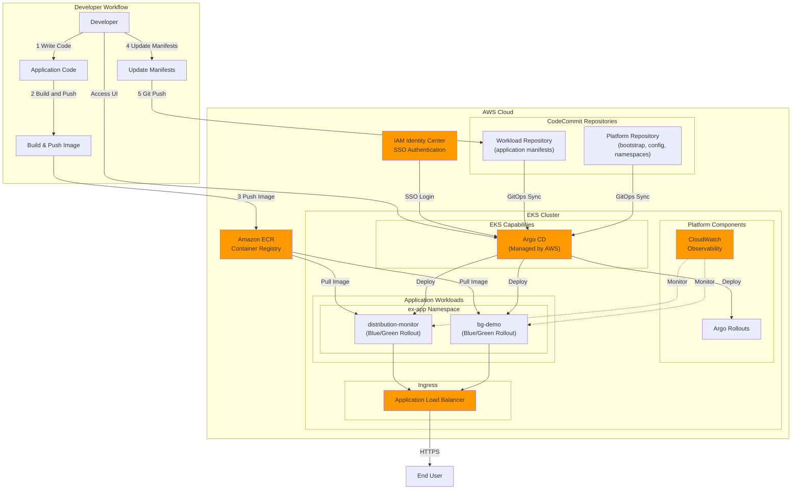
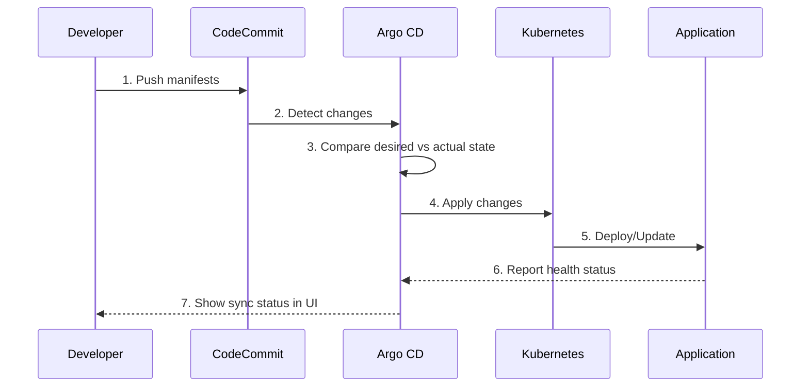
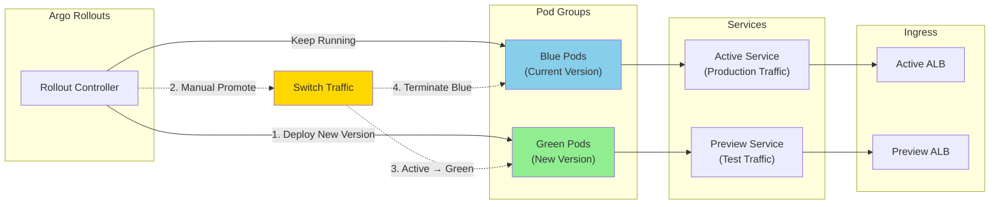
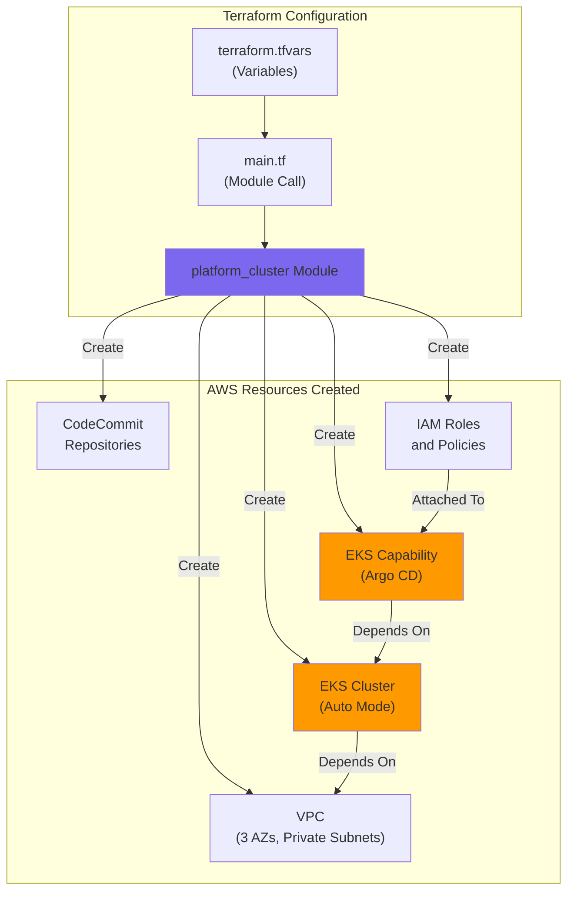
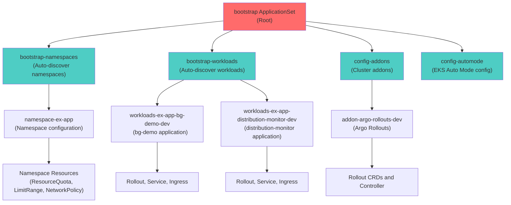
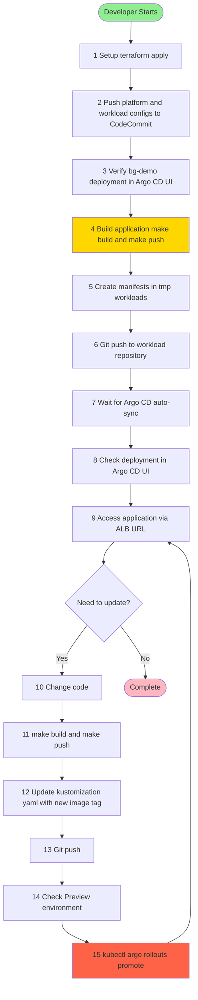

# Architecture Diagrams

## Overall Architecture

## GitOps Flow

## Blue/Green Deployment Flow

## Terraform Infrastructure Provisioning

## ApplicationSet Hierarchy

## Developer Experience Flow

